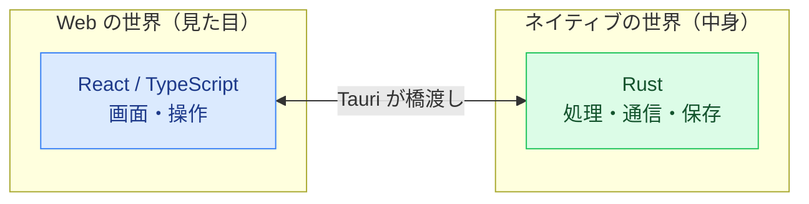

# 01. 技術スタック入門

このページは、DevDeck で使われている技術を **1つずつ「何者か」** を平易に説明します。
専門用語には、できるだけ身近なたとえを添えています。

> **「技術スタック」とは？**
> アプリを作るために組み合わせて使う技術の集まりのことです。
> 料理に例えると、材料（言語）・調理器具（フレームワーク）・保存容器（データベース）の
> 組み合わせ全体を指します。

---

## まず大枠：このアプリは「2つの世界」でできている

DevDeck は、性格の違う2つの部分が合体してできています。

- **Web の世界** … ふだん見ているウェブサイトと同じ技術（React など）で「画面」を作ります。
- **ネイティブの世界** … パソコンの機能（ファイル・パスワード保管など）を扱える Rust で「中身」を作ります。
- この2つをくっつけて、1つの Windows アプリにしているのが **Tauri** です。

---

## デスクトップアプリの土台

### Tauri（タウリ）2

- **何か**: Web技術で作った画面と、Rustで作ったプログラムを合体させて、
  WindowsやMacのデスクトップアプリにするための道具（フレームワーク）。
- **このアプリでの役割**: アプリの「外側の枠」。ウィンドウを表示し、画面（React）と
  中身（Rust）の間でメッセージをやり取りする仕組み（これを **IPC** と呼びます）を提供します。
- **たとえ**: 家でいう「骨組みと外壁」。中の家具（画面）と配管（処理）をまとめて1軒の家にする。
- **補足**: Electron という似た道具より軽量です。DevDeck はブラウザ機能を丸ごと同梱せず、
  Windows に元から入っている **WebView2**（Edgeの表示エンジン）を借りて画面を描くため、
  インストーラがとても小さく済みます。
- 公式: <https://tauri.app/>

### IPC（あいぴーしー / プロセス間通信）

- **何か**: 別々に動いているプログラム同士がメッセージを送り合う仕組み。
- **このアプリでの役割**: 画面（React）が「PRを検索して」と頼むと、その依頼が Rust 側に届き、
  結果が返ってきます。この往復が IPC です。Tauri では `invoke("コマンド名", 入力)` という形で呼びます。
- **たとえ**: レストランの「注文票」。客（画面）が書いた注文票が厨房（Rust）に渡り、料理が返ってくる。

---

## 画面（フロントエンド）を作る技術

### React（リアクト）19

- **何か**: 画面の部品（ボタン・表・パネルなど）を「コンポーネント」という単位で組み立てる、
  世界中で広く使われている画面づくりのライブラリ。
- **このアプリでの役割**: 検索フォーム、結果の一覧表、プレビューパネルなど、目に見える部分すべて。
- **たとえ**: レゴブロック。小さな部品を組み合わせて画面という作品を作る。
- 公式: <https://react.dev/>

### TypeScript（タイプスクリプト）

- **何か**: JavaScript（ブラウザを動かす言語）に「型（データの種類）」のチェックを足した言語。
- **このアプリでの役割**: 「ここには数値が入るはず」をあらかじめ決めておき、書き間違いを
  実行前に見つけられるようにします。フロント側のほぼ全コードが TypeScript です。
- **たとえ**: 書類の記入欄に「日付」「金額」とラベルが付いていて、間違った欄に書くと気づける状態。
- 公式: <https://www.typescriptlang.org/>

### Vite（ヴィート）

- **何か**: 開発中に画面を高速に表示・再読み込みし、最後に配布用へまとめる「ビルドツール」。
- **このアプリでの役割**: `pnpm dev` で開発用サーバを立ち上げ、コードを保存すると即座に画面へ反映します。
- **たとえ**: 料理を素早く出してくれる調理アシスタント。
- 公式: <https://vite.dev/>

### Tailwind CSS（テイルウィンド）

- **何か**: `text-sm`（小さい文字）`flex`（横並び）のような短い名前を組み合わせて見た目を整える仕組み。
- **このアプリでの役割**: 余白・色・配置などのデザインを、HTMLに近い場所で手早く指定します。
- **たとえ**: 服装を「白シャツ・黒ズボン」のように既製パーツの指定で素早く決める感覚。
- 公式: <https://tailwindcss.com/>

### TanStack Query（タンスタッククエリ）

- **何か**: サーバから取ってきたデータの取得・キャッシュ（一時保存）・再取得を面倒見てくれる仕組み。
- **このアプリでの役割**: 「PR一覧を取得し、画面に表示し、必要なら裏で更新する」といった
  サーバ由来データの管理を担当します。同じデータを何度も無駄に取りに行かないようにもします。
- **たとえ**: 図書館の司書。「その本ならさっき借りた分があるよ」と無駄足を防いでくれる。
- 公式: <https://tanstack.com/query>

### Zod（ゾッド）

- **何か**: 「このデータはこういう形のはず」というルールを書いておき、実際のデータが
  そのルールに合うか **実行時に検証** するライブラリ。
- **このアプリでの役割**: Rust から返ってきたデータが想定どおりの形かを画面側で確認します。
  形が違えばその場でエラーにして、壊れたデータが画面に流れ込むのを防ぎます。
  （`src/lib/azdoCommands.ts` に検証ルールがまとまっています。）
- **たとえ**: 荷物の検品。届いた箱の中身が注文どおりかチェックしてから棚に並べる。
- 公式: <https://zod.dev/>

### その他の画面まわり

- **dompurify** … Azure DevOps から来た「リッチテキスト（HTML）」を**安全に掃除**してから表示する
  （危険なタグを除去する）ライブラリ。
- **marked** … Markdown（記法付きテキスト）をHTMLに変換するライブラリ。
- **lucide-react** … アイコン集。
- **diff** … 2つのテキストの差分（どこが変わったか）を計算する。PRの変更表示などで使用。

---

## 中身（バックエンド）を作る技術

### Rust（ラスト）

- **何か**: 高速で、メモリの安全性に強い、ネイティブアプリ向けのプログラミング言語。
- **このアプリでの役割**: アプリの「頭脳」。データの加工、保存、外部通信、認証などの
  実処理を担当します（`src-tauri/src/` 配下）。
- **たとえ**: 厨房の料理人。注文（IPC）を受けて、実際に調理（処理）して料理（結果）を返す。
- 公式: <https://www.rust-lang.org/>

### tokio（トキオ）

- **何か**: Rust で「複数の処理を待ち時間なく並行して進める（非同期処理）」ための仕組み。
- **このアプリでの役割**: ネット通信のような「待ち」が発生する処理の間も画面を固まらせず、
  バックグラウンド同期のような定期処理も回します。
- **たとえ**: 料理人が「煮込みを待つ間に別の盛り付けをする」ような段取り。

### クレート（crate）とは

- **何か**: Rust における「部品ライブラリ」の単位。
- **このアプリでの役割**: 通信処理だけを切り出した独立部品 `azdo-client`（後述）を「クレート」として
  分けています。Tauri に依存しないので、単体でテストしやすいのが利点です。

### azdo-client（このアプリ独自の通信係クレート）

- **何か**: Azure DevOps の REST API とやり取りする処理だけを集めた独立クレート（`crates/azdo-client/`）。
- **このアプリでの役割**: HTTPでの問い合わせ、失敗時の再試行、認証ヘッダの付与などを一手に引き受けます。
  Tauri本体から切り離されているため、本物のクラウドに繋がなくても **wiremock**（偽サーバ）でテストできます。
- **たとえ**: 「外部とのやり取り専門の渉外担当」。窓口を1つにまとめてある。

---

## データの保存に使う技術

### SQLite（エスキューライト） / rusqlite

- **何か**: 1つのファイルで完結する小型のデータベース。サーバ不要で、アプリに同梱して使えます。
  rusqlite はそれを Rust から扱うためのライブラリ。
- **このアプリでの役割**: Azure DevOps から取得したPR・作業項目・コミットなどを **キャッシュ（一時保存）** し、
  起動直後でも素早く表示できるようにします（`azdodeck.sqlite3` というファイル）。
- **たとえ**: 手元のメモ帳。毎回クラウドに聞きに行かず、書き留めた内容をすぐ見返せる。
- 公式: <https://www.sqlite.org/>

### Windows 資格情報マネージャ / keyring

- **何か**: Windows が標準で持つ「パスワード金庫」。keyring はそこへ Rust から
  読み書きするためのライブラリ。
- **このアプリでの役割**: Azure DevOps にアクセスするための **PAT（個人用アクセストークン）** などの
  秘密情報を、ここに安全に保管します。SQLite やファイル・ログには **絶対に** 平文で書きません。
- **たとえ**: 家の金庫。大事な鍵はメモ帳（SQLite）ではなく金庫にしまう。

---

## 連携先（外部サービス）

### Azure DevOps（アジュール デブオプス） REST API 7.1

- **何か**: マイクロソフトが提供する、ソフト開発の管理サービス（コード・PR・チケット・CI/CDなど）。
  REST API は、それをプログラムから操作するための「インターネット越しの窓口」。
- **このアプリでの役割**: 本物のデータの置き場所。DevDeck はここから情報を取得し、
  コメント投稿や投票などの操作を送ります。
- **REST API とは**: 「このURLにこの形式で問い合わせると、この形式で返ってくる」という
  決まったルールでやり取りする、Web上の標準的な仕組み。
- 公式: <https://learn.microsoft.com/azure/devops/integrate/>

### reqwest（リクエスト）

- **何か**: Rust から HTTP（Webの通信）リクエストを送るための定番ライブラリ。
- **このアプリでの役割**: `azdo-client` の内部で、Azure DevOps へ実際の通信を行います。

---

## 次のページへ

ここまでで「部品の名前と役割」が分かりました。
次は、これらが **どう組み合わさっているか**（全体アーキテクチャ）を見ていきます。

→ [02-architecture.md](02-architecture.md)
