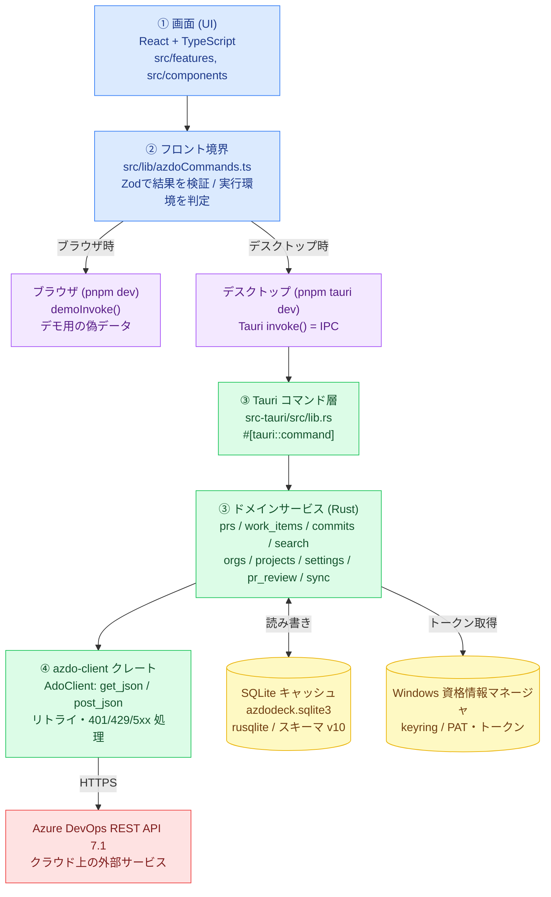

# 02. 全体アーキテクチャ

このページは、[01](01-tech-stack.md) で名前を知った部品が **どう組み合わさっているか** を説明します。
DevDeck は大きく **4つの層 + 2つの保存先** でできています。

> 編集可能な drawio 版: [`diagrams/architecture.drawio`](diagrams/architecture.drawio)

---

## 全体図

---

## 4つの層の役割

### ① 画面（React / `src/`）

ユーザーが直接触る部分です。検索フォーム、結果の一覧表、プレビュー、設定画面などがここにあります。

- **重要なルール**: 画面は Azure DevOps と直接やり取り **しません**。
  必ず次の「② フロント境界」を経由してデータを取りに行きます。
- サーバ由来のデータ（PR一覧など）は **TanStack Query** で管理し、取得・キャッシュ・再取得を任せます。

### ② フロント境界（`src/lib/azdoCommands.ts`）

画面と中身（Rust）の **唯一の出入り口** です。ここがこのアプリの設計の要になっています。

このファイルが担う3つの仕事:

1. **コマンドの呼び出し** … 「PR検索」などの依頼を、関数呼び出しの形で画面に提供する。
2. **実行環境の判定** … いまブラウザかデスクトップかを `isTauriRuntime()` で見分け、
   行き先を切り替える（後述の「2つの実行モード」）。
3. **結果の検証** … Rust から返ってきたデータを **Zod** で検査し、形が想定どおりか確かめてから画面に渡す。

### ③ Rust バックエンド（`src-tauri/src/`）

アプリの「頭脳」です。さらに2段に分かれています。

- **コマンド層（`lib.rs`）** … 画面からの依頼（IPC）を受け取る「受付窓口」。
  `#[tauri::command]` という印の付いた関数が窓口で、`generate_handler![]` に一覧登録されています。
  受付はすぐに各専門の「ドメインサービス」へ処理を渡します。
- **ドメインサービス** … 機能ごとに分かれた実処理。PRはPR担当、作業項目は作業項目担当、という具合に
  責務が分けられています（下の表）。

### ④ 通信係（`crates/azdo-client/`）

Azure DevOps と実際にインターネット越しに通信する独立部品（クレート）です。

- すべての通信は `AdoClient::get_json` / `post_json` などの共通入口を通ります。
  これにより、**再試行（リトライ）** や **401（認証切れ）・429（混雑）・5xx（サーバ障害）の扱い** が
  全機能で統一されます。
- Tauri に依存しないため、本物のクラウドなしで偽サーバ（wiremock）を使ってテストできます。

---

## 各モジュールの責務一覧

### フロント（`src/`）

| 場所 | 役割 |
|---|---|
| `src/App.tsx` | アプリの土台。ナビゲーション、表示中の画面（ビュー）の切り替え、キーボード操作の管理。 |
| `src/features/pull-requests/` | My Reviews / PR検索 / PRレビュー（差分・コメント・投票）画面。 |
| `src/features/work-items/` | My Work Items / 作業項目検索 / 保存ビュー / プレビュー・編集画面。 |
| `src/features/commits/` | コミット検索画面。 |
| `src/features/settings/` | 組織の追加・認証・各種設定画面。 |
| `src/components/` | 共通UI部品（コマンドパレット、ヘルプ、ナビ、リサイズ等）。 |
| `src/lib/azdoCommands.ts` | **フロント境界**（コマンド・Zodスキーマ・デモ分岐）。 |
| `src/lib/azdoDemo.ts` | ブラウザ時に使う偽データ（デモ）の実装。 |
| `src/lib/runtime.ts` | `isTauriRuntime()`（実行環境の判定）。 |
| `src/lib/markdown.tsx` ほか | リッチテキストの整形・サニタイズ等の補助。 |

### Rust バックエンド（`src-tauri/src/`）

| ファイル | 役割 |
|---|---|
| `lib.rs` | Tauri コマンドの定義と一覧登録。アプリ起動時の初期化。 |
| `main.rs` | 実行のエントリポイント（`lib.rs` の `run()` を呼ぶだけ）。 |
| `prs.rs` | プルリクエストの検索・一覧・同期。 |
| `pr_review.rs` | PRレビュー（差分取得・コメント投稿/編集/削除・スレッド状態・投票）。 |
| `work_items.rs` | 作業項目の検索・一覧・プレビュー・編集・コメント・画像取得・同期。 |
| `commits.rs` | コミットの検索・リポジトリ一覧・同期。 |
| `search.rs` | 横断検索（コマンドパレットの `search_all`）。 |
| `orgs.rs` | 組織の追加・削除・一覧（認証の検証を含む）。 |
| `projects.rs` | プロジェクト情報の取り扱い。 |
| `settings.rs` | アプリ設定（DBのみ使用。レビュー結果プレビューなど）。 |
| `sync.rs` | バックグラウンド同期ループ。`sync:updated` イベントと通知。 |
| `auth.rs` | 認証情報の提供（PAT / Azure CLI）と組織向けクライアント生成。 |
| `secrets.rs` | keyring（Windows 資格情報マネージャ）への秘密情報アクセス。 |
| `db.rs` | SQLite アクセスとスキーマ移行（マイグレーション）。 |
| `error.rs` | IPC向けエラー型 `AppError`（各種エラーをまとめて画面へ返す）。 |

### 通信係クレート（`crates/azdo-client/src/`）

| ファイル | 役割 |
|---|---|
| `client.rs` | `AdoClient` 本体。HTTP送信・リトライ・ステータス処理。 |
| `auth.rs` | 認証ヘッダの提供（PAT / Azure CLI トークン）。 |
| `git.rs` | Git 関連（PR・コミット・差分）の REST 呼び出し。 |
| `work_items.rs` | 作業項目関連の REST 呼び出し（WIQL など）。 |
| `pr_review.rs` | PRレビュー関連の REST 呼び出し。 |
| `identity.rs` | 認証ユーザー情報（connectionData）。 |
| `error.rs` | クライアント層のエラー型 `AdoError`。 |
| `lib.rs` | クレートの公開窓口。 |

---

## 設計判断（なぜこうなっているか）

初心者の方が「なぜわざわざ複雑にしているの？」と感じやすい点を、理由とともに説明します。

### なぜ Tauri なのか

- Web技術（React）で画面を作りつつ、Windows の機能（資格情報マネージャなど）も使いたいから。
- ブラウザエンジンを同梱せず **WebView2** を借りるため、インストーラが小さく軽い。

### なぜ「フロント境界（azdoCommands.ts）」を1か所に集めるのか

- 画面のあちこちから直接 Rust を呼ぶと、検証や環境判定が散らばって壊れやすい。
- 出入り口を1つにすると、**Zod検証・デモ分岐・環境判定** をまとめて面倒見られる。

### なぜ通信係を別クレート（azdo-client）に分けるのか

- Tauri に依存しない純粋な通信部品にすると、**偽サーバ（wiremock）で単体テスト** できる。
- 再試行やエラー処理を1か所に集約でき、全機能で挙動が揃う。

### なぜ SQLite にキャッシュするのか

- 毎回クラウドに問い合わせると遅く、回数制限（429）にも当たりやすい。
- いったん手元に保存しておけば、起動直後でも素早く表示でき、裏で静かに最新化できる。

### なぜ秘密情報を keyring（資格情報マネージャ）に置くのか

- PAT などのトークンは漏れると危険。SQLite・設定ファイル・ログに平文で残すのは厳禁。
- OS標準の安全な保管場所（金庫）に預けるのが最も安全だから。

---

## 次のページへ

部品の組み合わせが分かったら、次は「ボタンを押してから結果が出るまでの流れ」を追います。

→ [03-data-flow.md](03-data-flow.md)
