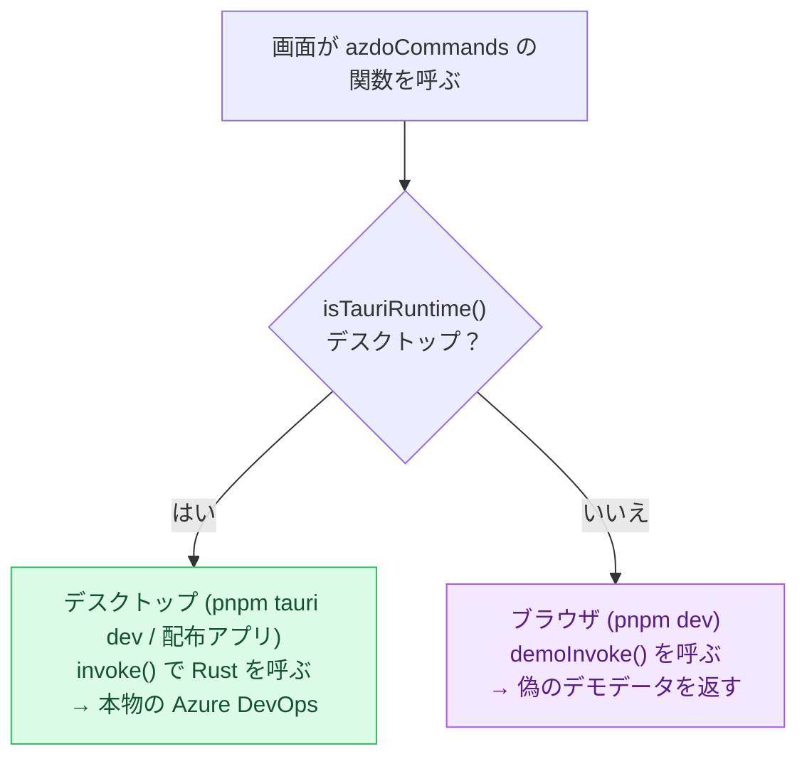
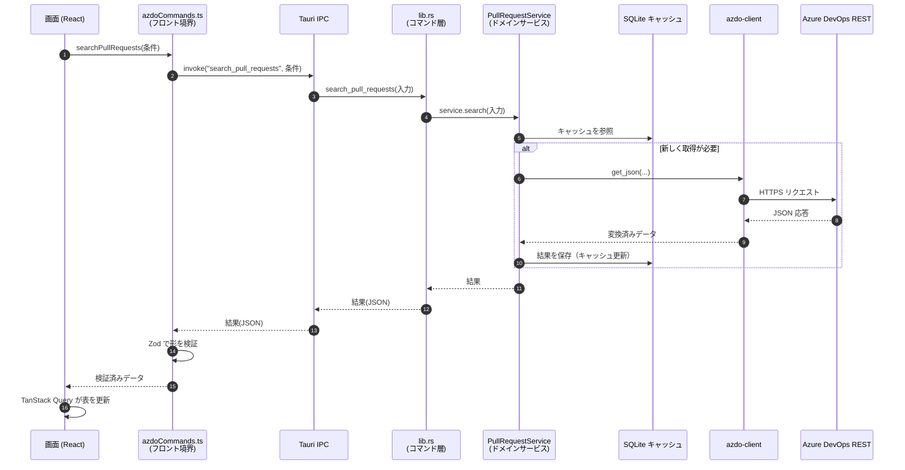
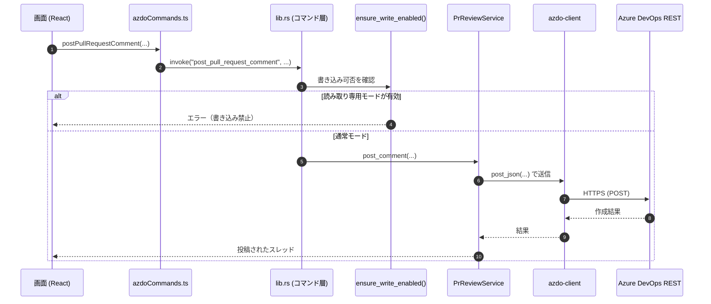
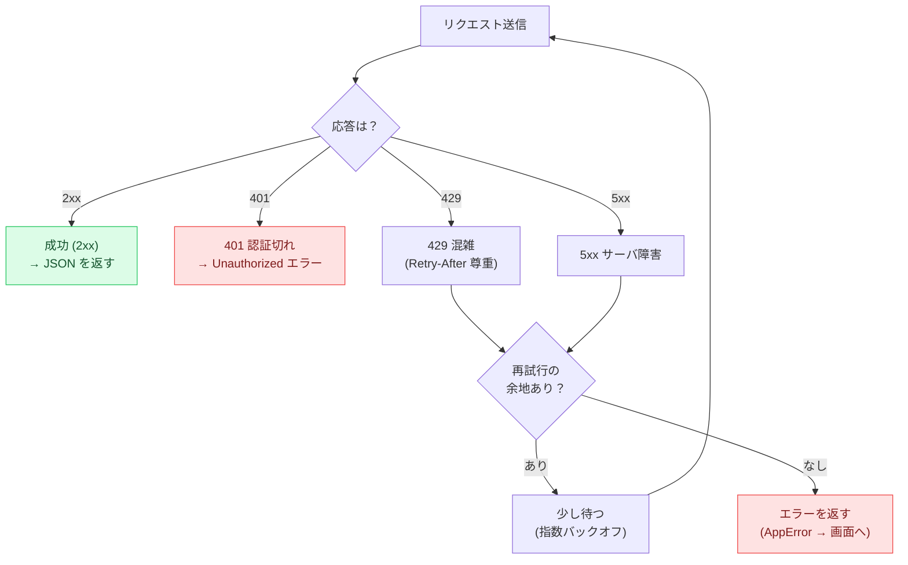
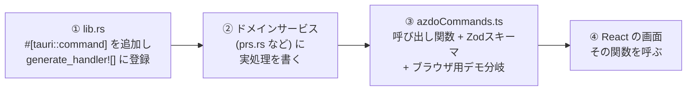

# 03. データフロー（処理の流れ）

このページは、画面で操作したことが **裏側でどう処理され、結果が返ってくるか** を追います。
「ボタンを押すと何が起きるの？」に答えるページです。

> 編集可能な drawio 版: [`diagrams/data-flow.drawio`](diagrams/data-flow.drawio)

---

## まず大前提：2つの実行モード

AzDoDeck は **2通りの動かし方** があり、データの行き先が変わります。
ここを理解すると、後の図がぐっと分かりやすくなります。

- **デスクトップモード**（`pnpm tauri dev`、または配布された `.exe`/`.msi`）
  … 本物の Tauri が動いており、`invoke()` で Rust を呼び、実際の Azure DevOps に繋がります。
- **ブラウザモード**（`pnpm dev`）
  … Tauri が無い環境。UI開発を素早く回すために、`demoInvoke()` が **偽のデモデータ** を返します。
  本物のクラウドには一切繋がりません。

> **なぜ2モードあるの？**
> 画面（UI）の見た目や操作を試すだけなら、毎回クラウドに繋ぐのは遅くて不便です。
> ブラウザモードなら、ネット接続も認証もなしに、すぐ画面を確認できます。
> この切り替えは `src/lib/azdoCommands.ts` が自動で行うため、画面側のコードは同じまま動きます。

---

## 読み取りの流れ（例：プルリクエスト検索）

「PR検索」で[検索]ボタンを押したときの、デスクトップモードでの道のりです。

ポイント:

- 画面は **直接クラウドを呼ばない**。必ず「フロント境界 → IPC → コマンド層 → サービス → 通信係」の順。
- サービスは **まず SQLite キャッシュ** を見て、必要に応じて Azure DevOps に取りに行きます。
- 返り値は **Zod で検証** されてから画面に渡るので、壊れたデータが表示されにくい。

---

## 書き込みの流れ（例：PRへのコメント投稿・投票）

データを「読む」だけでなく「変更する」操作（コメント投稿、投票、作業項目の状態変更など）もあります。
読み取りとの違いは、**書き込みガード** が入る点です。

ポイント:

- 書き込み系コマンド（`post_pull_request_comment`、`submit_pull_request_vote`、
  `set_work_items_state` など）は、最初に **`ensure_write_enabled()`** を通ります。
- 設定で **「読み取り専用バリデーションモード」** が有効なときは、ここで止めて
  誤って本番データを変更しないようにします（動作確認時の安全装置）。
- 画面に変更が反映されるよう、フロント側では関連する **TanStack Query のキャッシュを更新/無効化** します。

---

## 通信の信頼性：リトライとエラー処理

クラウドとの通信は、混雑や一時的な障害で失敗することがあります。
`azdo-client`（`AdoClient`）は、共通の入口（`get_json` / `post_json` 等）で次のように対処します。

具体的な既定値（`crates/azdo-client/src/client.rs`）:

- **試行回数**: 最大 3 回
- **待ち時間の基準**: 250 ミリ秒から始め、回を追うごとに倍に（指数バックオフ。上限 2 秒）
- **429（混雑）**: サーバが返す `Retry-After` を尊重（上限 5 秒でキャップ）
- **再試行する条件**: 429 / 5xx の応答、または接続・タイムアウトのネットワークエラー
- **401（認証切れ）**: 再試行せず、すぐ認証エラーとして返す

エラーは Rust 側で **`AppError`**（`src-tauri/src/error.rs`）にまとめられ、JSON の `message` として
画面へ届きます。画面側は `commandErrorMessage()` でその文言を取り出して表示します。

---

## IPC を増やす/変えるときの「4点契約」

新しいコマンド（機能）を1つ足すときは、**4か所をセットで** 直すのがこのプロジェクトの決まりです
（`AGENTS.md` 由来）。1か所でも欠けると、ブラウザモードや型チェックが壊れます。

| # | 場所 | やること |
|---|---|---|
| 1 | `src-tauri/src/lib.rs` | `#[tauri::command]` 関数を追加し、`generate_handler![]` に登録 |
| 2 | 対応するサービス（`prs.rs` 等） | ドメインの実処理を実装 |
| 3 | `src/lib/azdoCommands.ts` | 呼び出し関数・**Zodスキーマ**・**ブラウザ用デモ分岐** を追加 |
| 4 | React の機能コンポーネント | 追加した関数を呼ぶ |

> ③のデモ分岐とスキーマは「後回しの飾り」ではなく **必須作業** です。
> これが無いとブラウザモードが動かなくなります。

---

## 次のページへ

最後に、データが「どこに保存され、どう最新化されるか」を見ていきます。

→ [04-data-and-sync.md](04-data-and-sync.md)
