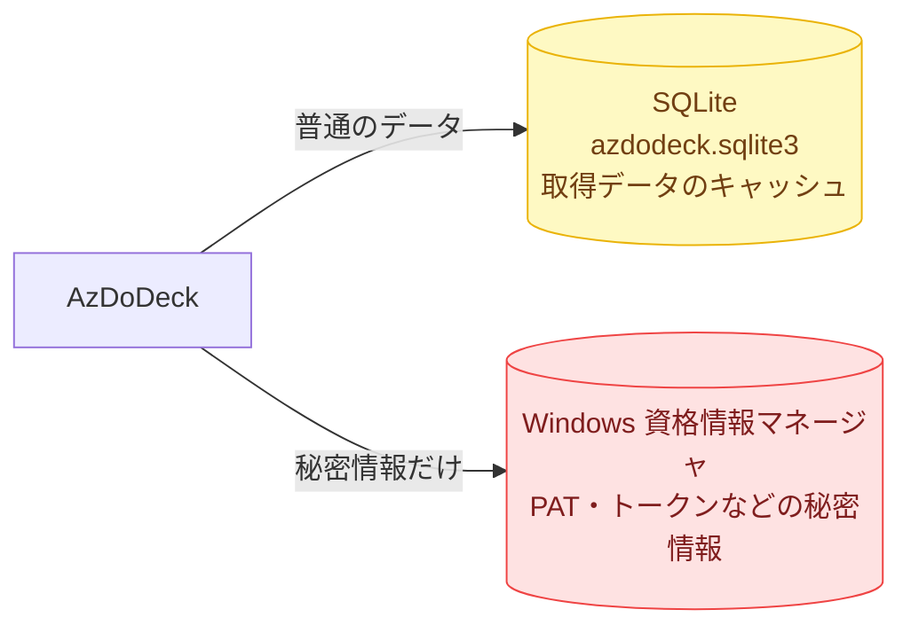
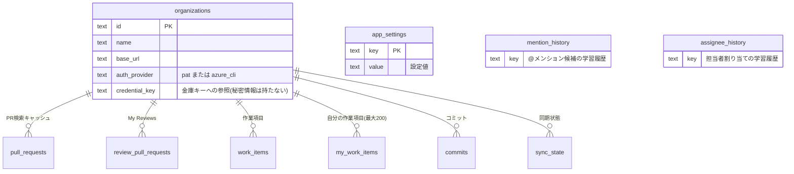
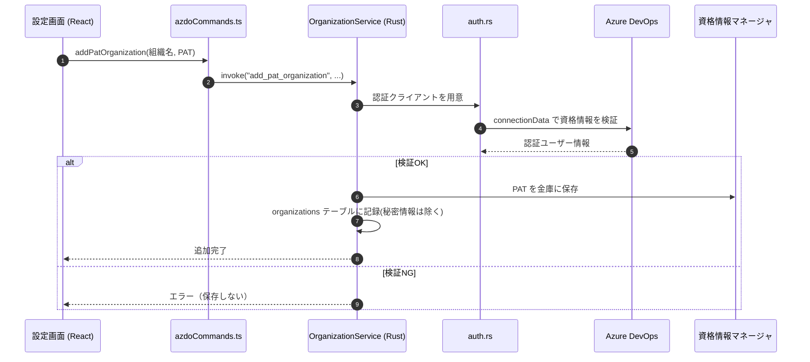
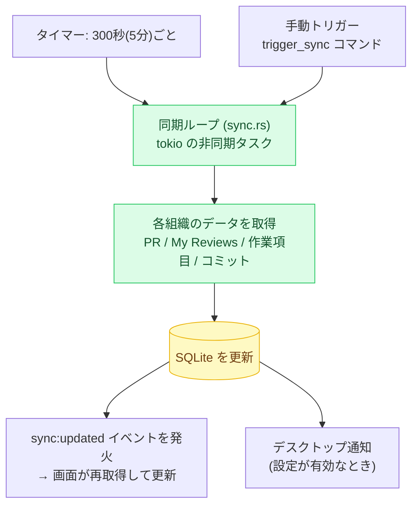
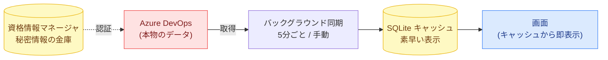

# 04. データと同期

このページは、AzDoDeck が **どこに何を保存し、どう最新化し、秘密情報をどう守るか** を説明します。

---

## 2つの保存先

AzDoDeck はパソコン内に2か所、性格の違う保存先を持っています。

| 保存先 | 入れるもの | 入れないもの |
|---|---|---|
| **SQLite**（`azdodeck.sqlite3`） | PR・作業項目・コミット等のキャッシュ、設定、同期状態 | **秘密情報は絶対に入れない** |
| **資格情報マネージャ**（keyring） | PAT、Azure CLI トークンなどの秘密情報のみ | 普通のデータは入れない |

> 原則: **秘密情報は SQLite・設定ファイル・ログ・テスト・デモに平文で残さない**。
> 必ず OS の金庫（資格情報マネージャ）に預けます。

---

## SQLite キャッシュ（データモデル）

### なぜキャッシュするのか

毎回クラウドに問い合わせると遅く、混雑エラー（429）にも当たりやすくなります。
そこで一度取得したデータを手元の SQLite に保存し、**起動直後でも素早く表示**しつつ、
裏で静かに最新化します（同期は後述）。

### 主なテーブル

`src-tauri/src/db.rs` が管理します。現在のスキーマ版は **10** です。

| テーブル | 役割 |
|---|---|
| `organizations` | 接続中の Azure DevOps 組織。認証方式や資格情報キーへの参照を持つ（**秘密情報そのものは持たない**）。 |
| `app_settings` | アプリ設定（レビュー結果フォルダ、通知、読み取り専用モードなど）。 |
| `pull_requests` | PR検索結果のキャッシュ。 |
| `review_pull_requests` | 「My Reviews」（自分がレビュアーのPR）のキャッシュ。 |
| `work_items` | 作業項目のキャッシュ。 |
| `my_work_items` | 自分に割り当てられた作業項目のスナップショット（最大200件）。 |
| `commits` | コミット検索結果のキャッシュ。 |
| `sync_state` | 各同期がいつ・どうなったかの状態。 |
| `mention_history` | @メンション候補の学習用履歴。 |
| `assignee_history` | 担当者割り当ての学習用履歴。 |

### スキーマ移行（マイグレーション）とは

アプリを更新すると、保存形式（テーブルの構造）が変わることがあります。
`db.rs` の `migrate()` は SQLite の `PRAGMA user_version` を見て、
古い形式のDBを現在の版（11）まで **段階的に作り変えます**。
利用者がデータを消さなくても、起動時に自動で最新形式へ更新されます。

---

## 認証と秘密情報

### 2つの認証方式

組織ごとに、次のどちらかの方式で Azure DevOps に接続します（`auth_provider` の値）。

| 値 | 方式 | しくみ |
|---|---|---|
| `pat` | **個人用アクセストークン (PAT)** | `Authorization: Basic base64(":{pat}")` を付けて通信。 |
| `azure_cli` | **Azure CLI** | `az account get-access-token` を実行してトークンを取得し、ベアラートークンとして使用。取得後は**メモリ上に5分間**キャッシュ。 |

> 注意: コード上の値は **アンダースコア形式**（`pat` / `azure_cli`）です。
> ハイフン形式（`azure-cli`）は資格情報キーの一部としてのみ使われます。

### 秘密情報の保管場所

`secrets.rs` が keyring 経由で Windows 資格情報マネージャに読み書きします。

- **サービス名**: `AzDoDeck`
- **資格情報キーの形**:
  - `azdodeck:org:{org}:pat`
  - `azdodeck:org:{org}:azure-cli`

### 認証の流れ（組織を追加するとき）

ポイント: **先に Azure DevOps で資格情報を検証してから** 保存します。
無効な資格情報をそのまま保存してしまわないための順序です。

---

## バックグラウンド同期

「最新の状態」を保つため、AzDoDeck は裏側で定期的にクラウドからデータを取り直し、
SQLite キャッシュを更新します。担当は `src-tauri/src/sync.rs` の同期ループです。

### しくみ

- **間隔**: 約 **300 秒（5分）** ごとに自動実行。前回の同期が長引いた場合でも、
  取りこぼした分を一気に連続実行しない設定になっています。
- **手動実行**: `trigger_sync` コマンドで即時に同期できます。
- **同期の範囲（`SyncScope`）**: `All`（全部）/ `Hot`（よく使う分）/ `MyReviews` /
  `MyWorkItems` / `Commits` を切り替え可能。
- **完了通知**: 同期後に `sync:updated` イベントを発火し、画面側がデータを取り直して表示を更新します。

### デスクトップ通知

設定で有効にすると、同期時に次の変化を Windows のデスクトップ通知で知らせます。

- **作業項目が自分に割り当てられた**（assigned）
- **作業項目の状態が変わった**（state changed）

通知に本文プレビューを含めるか等は設定で調整できます（`app_settings`）。

---

## まとめ

- **本物のデータ**はクラウド（Azure DevOps）にある。
- それを**同期**で取り寄せ、**SQLite**にキャッシュして素早く表示する。
- **秘密情報**だけは別格で、OS の**金庫（資格情報マネージャ）**に保管する。

---

最初のページに戻る → [README.md](README.md)
