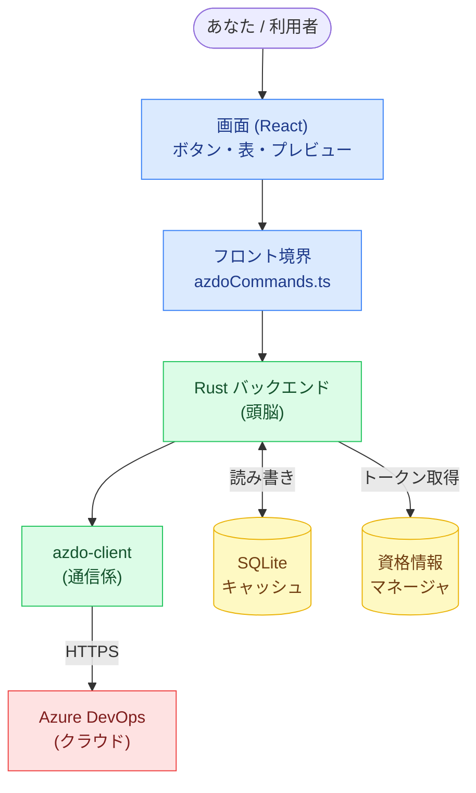

# AzDoDeck 設計資料（初心者向け）

このフォルダは、AzDoDeck というアプリが **どんな技術で・どう動いているか** を、
プログラミングや技術スタックにまだ詳しくない人にも分かるように図解した設計資料です。

> AzDoDeck は「Azure DevOps（マイクロソフトの開発管理サービス）の中身を、
> 自分のパソコンのデスクトップアプリから素早く検索・操作する」ための Windows アプリです。
> プルリクエスト（コードレビュー依頼）、作業項目（チケット）、コミット（変更履歴）を
> 1つの画面から横断して探せます。

---

## 読む順番（目次）

上から順に読むと、全体像 → 部品 → 動きの流れ、と理解が深まる構成になっています。

| # | ファイル | 内容 | こんな疑問に答えます |
|---|---|---|---|
| 1 | [01-tech-stack.md](01-tech-stack.md) | **技術スタック入門** | 「React って何？Tauri って何？」を1つずつ平易に |
| 2 | [02-architecture.md](02-architecture.md) | **全体アーキテクチャ** | 「どんな部品が、どう組み合わさっている？」 |
| 3 | [03-data-flow.md](03-data-flow.md) | **データフロー** | 「ボタンを押すと、裏側で何が起きる？」 |
| 4 | [04-data-and-sync.md](04-data-and-sync.md) | **データと同期** | 「どこに何が保存され、どう最新化される？」 |

最初の1ページだけ読むなら **[01-tech-stack.md](01-tech-stack.md)** から始めてください。

---

## 技術スタック早見表

詳しい説明は [01-tech-stack.md](01-tech-stack.md) にありますが、まずは全体を一覧で。

| 役割 | 使っている技術 | ひとことで言うと |
|---|---|---|
| アプリの「外側の枠」 | **Tauri 2**（Rust製） | Web画面とRustのプログラムをくっつけてWindowsアプリにする道具 |
| 画面（見た目・操作） | **React 19 + TypeScript** | ボタンや表など、目に見える部分を作る |
| 画面の組み立て補助 | Vite / Tailwind CSS / TanStack Query / Zod | 開発を速く・見た目を整え・データ取得と検証を助ける |
| アプリの「頭脳」 | **Rust** | データの加工・判断などの中身の処理 |
| 外部との通信 | **azdo-client クレート**（reqwest） | Azure DevOps とインターネット越しにやり取りする係 |
| データの保存（キャッシュ） | **SQLite**（rusqlite） | 取得したデータをパソコン内に一時保存して高速化 |
| パスワードの保管 | **Windows 資格情報マネージャ**（keyring） | アクセストークンを安全に保管 |
| 連携先 | **Azure DevOps REST API 7.1** | クラウド上にある本物のデータの置き場所 |

---

## 図の見方

この資料の図は **2つの形式** で用意しています。目的に応じて使い分けてください。

### 1. Mermaid 図（各 Markdown に直接埋め込み）

各ページの本文中に「コードで書かれた図」が埋め込まれています。
**GitHub の画面**や、**VS Code のプレビュー**で、追加ツールなしにそのまま図として表示されます。

- VS Code でプレビューする: 対象の `.md` ファイルを開き、右上の「プレビュー」ボタン（または `Ctrl+Shift+V`）。
- もし図がコードのまま表示される場合は、Markdown プレビューが Mermaid に対応しているか確認してください
  （VS Code の標準プレビューは対応済み。拡張機能「Markdown Preview Mermaid Support」を入れると確実です）。

### 2. drawio 図（`diagrams/` フォルダの `.drawio` ファイル）

主要な図は、自由に編集できる **drawio 形式** でも置いています。レイアウトを変えたい・図を追加したい時はこちらを編集します。

- `diagrams/architecture.drawio` … 全体アーキテクチャの図
- `diagrams/data-flow.drawio` … データの流れ（PR検索を例にした処理の道のり）

**drawio の開き方（どちらか）:**

- **ブラウザ**: <https://app.diagrams.net/> を開き、`Open Existing Diagram` から `.drawio` ファイルを選ぶ。
- **VS Code**: 拡張機能「**Draw.io Integration**（`hediet.vscode-drawio`）」をインストールすると、
  `.drawio` ファイルをクリックするだけで編集画面が開きます（おすすめ）。

> Mermaid と drawio は **同じ内容を別の形式で** 表したものです。
> 「読むだけ」なら Mermaid、「図を直したい」なら drawio、と覚えてください。

---

## このアプリの全体像（1枚）

細かい説明の前に、まず1枚で。各部品の詳細は [02-architecture.md](02-architecture.md) で解説します。



---

## この資料を更新するときは

- 文章を直す → 対応する `.md` を編集。
- Mermaid 図を直す → `.md` 内の ```` ```mermaid ```` ブロックを編集。
- drawio 図を直す → `diagrams/*.drawio` を drawio で開いて編集。
- **コードの事実と図がずれていないか** を確認してください。図はあくまで現状コードの説明です。
